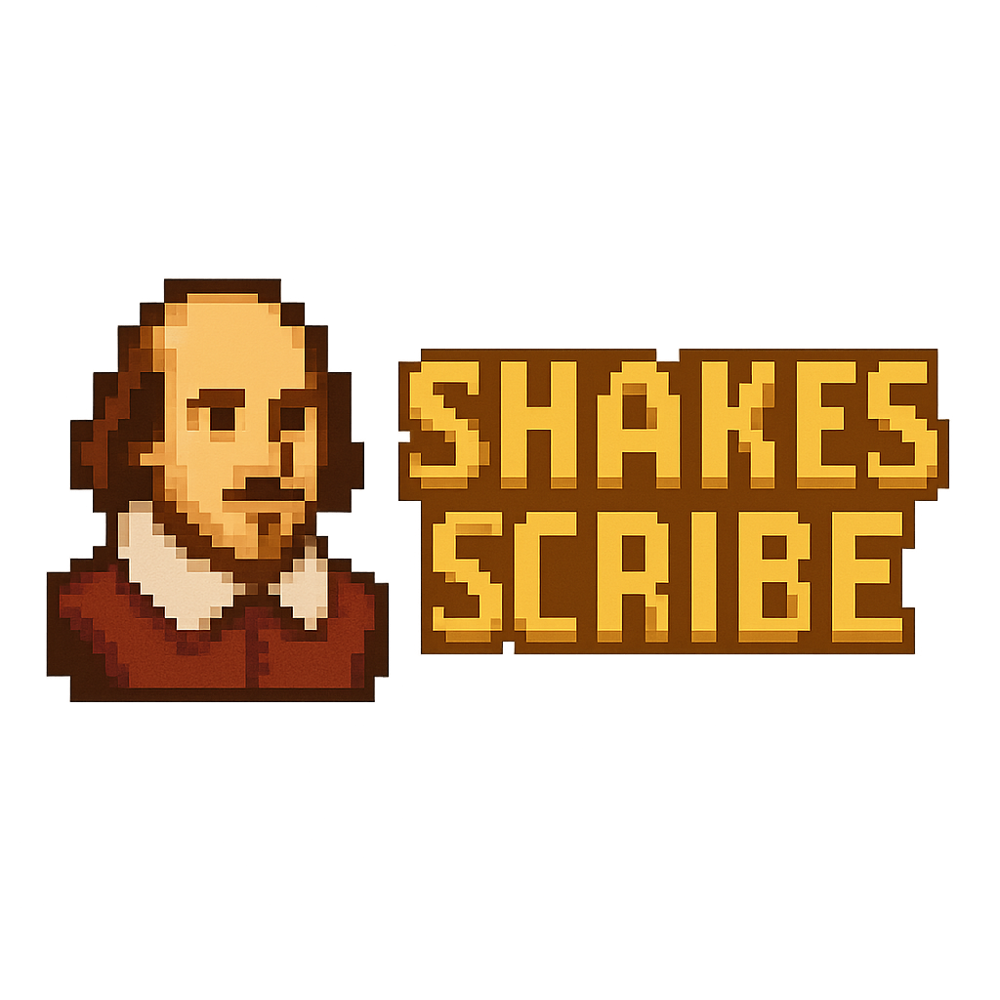
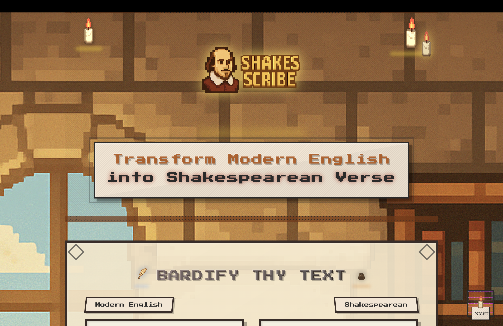
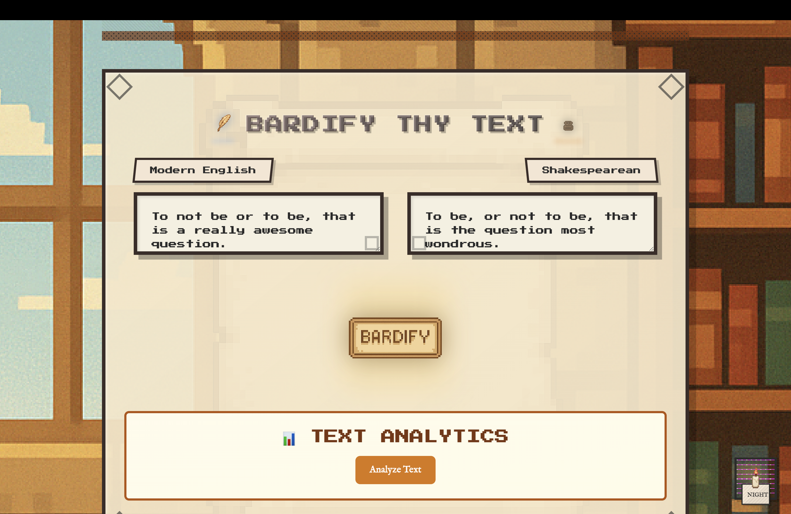
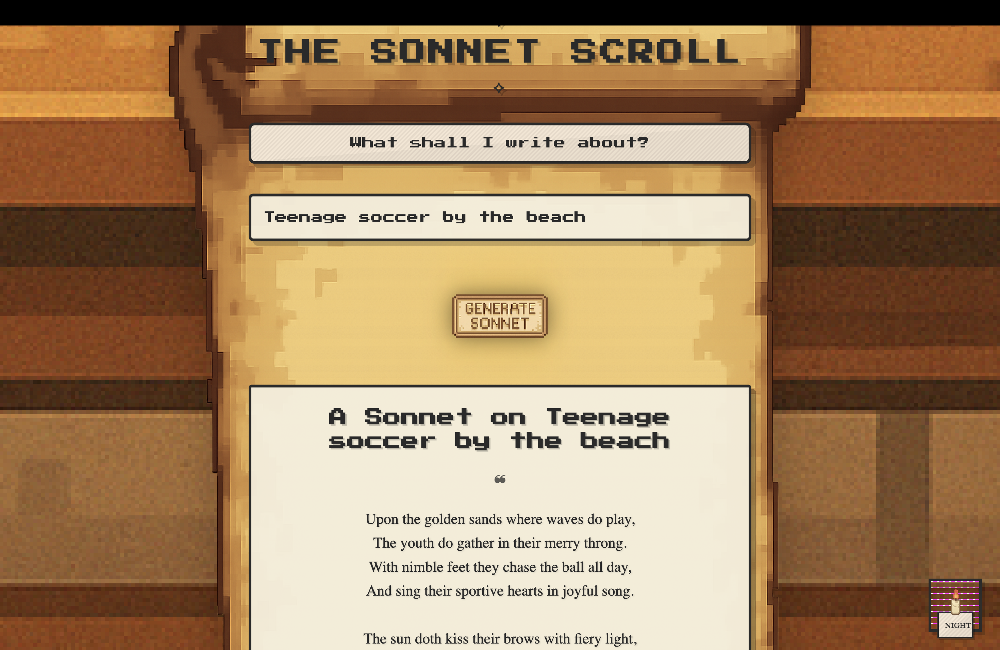
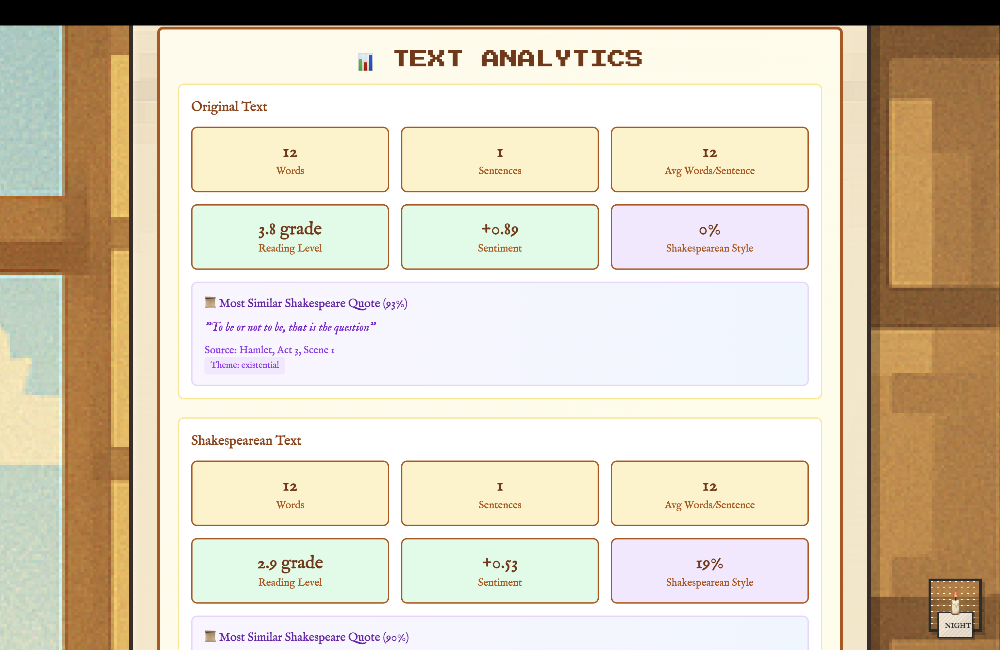
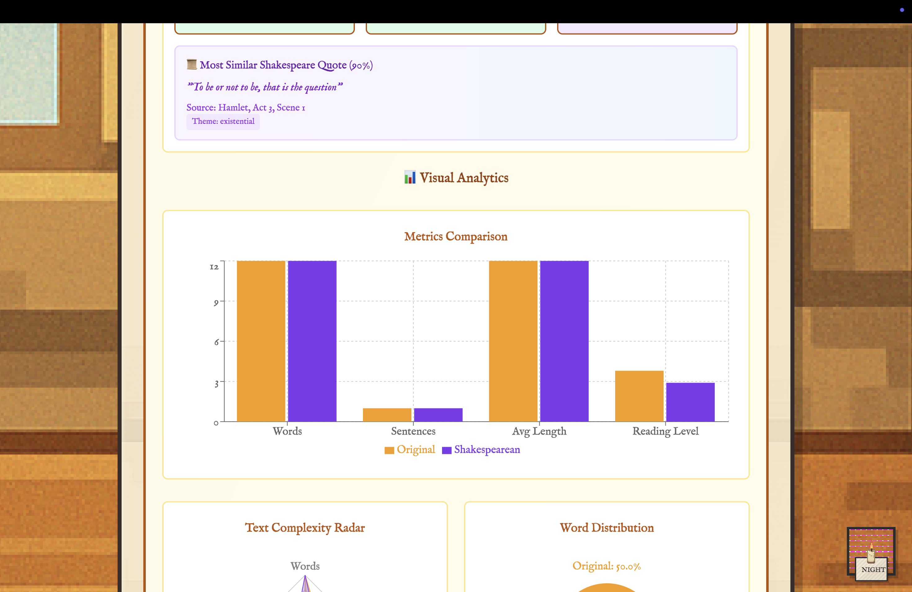

# ShakeScribe ✨

Ever wondered what your text would sound like if Shakespeare wrote it? ShakeScribe is my passion project that brings the Bard's eloquent language to modern times! Transform any text into beautiful Shakespearean prose, generate authentic sonnets, and discover how your words connect to the most famous quotes in literary history.



## What Makes ShakeScribe Special?

I built ShakeScribe because I've always been fascinated by Shakespeare's mastery of language. This isn't just another translation tool - it's a complete literary experience that combines AI magic with the timeless beauty of Elizabethan English.

### Welcome to Your Digital Scriptorium
Step into a cozy medieval study where magic happens! The interface feels like you're sitting in Shakespeare's own writing room, complete with flickering candles, ancient scrolls, and that perfect old-world atmosphere.



### Bardify Your Words 📜
Whether you're writing a love letter, a dramatic monologue, or just want to make your grocery list sound epic, ShakeScribe transforms your modern English into the poetic language that made Shakespeare immortal.



### Create Beautiful Sonnets 🌹
Want to write a sonnet but don't know where to start? Just give me a topic - love, nature, pizza, anything! - and watch as ShakeScribe crafts a genuine Shakespearean sonnet with proper meter and rhyme scheme.



### Discover Your Literary DNA 🔍
This is where things get really exciting! My analytics dashboard doesn't just count words - it uses advanced AI to understand the soul of your text. Find out which famous Shakespeare quote your writing most resembles, analyze the sentiment and style, and see how "Shakespearean" your text really sounds.



### Dive Deep into Text Metrics 📊
For the data lovers out there, get detailed insights into your text's readability, complexity, and emotional tone. It's like having a literary professor analyze your writing, but way more fun!



## The Magic Behind the Curtain ✨

**The Brain**: DeepSeek AI handles the language transformation with incredible accuracy
**The Heart**: A custom ML engine that understands Shakespeare's style and finds connections to famous quotes

**The Soul**: Carefully crafted pixel art and animations that make every interaction delightful

## Want to Run Your Own ShakeScribe? 🚀

### What You'll Need
- Node.js (the engine that runs modern web apps)
- Python (for the smart analytics features)  
- A DeepSeek API key (free to get!)
- Redis (helps everything run smoothly)

### Getting Started

**1. Get the Code**
```bash
git clone https://github.com/yourusername/shakescribe
cd shakescribe
```

**2. Set Up the Frontend**
```bash
cd frontend
npm install
npm run dev
```

**3. Set Up the Backend**
```bash
cd backend
npm install
# Add your API key to a .env file
npm run dev
```

**4. Set Up Analytics**
```bash
cd analytics
python -m venv venv
source venv/bin/activate
pip install -r requirements.txt
python app.py
```

**5. Get Your API Key**
Head over to [Together.ai](https://www.together.ai/) and grab a free API key. It's what lets ShakeScribe talk to the AI that does all the language magic!

## Connect With Me 🤝

Found a bug? Have a feature idea? Just want to share what ShakeScribe created for you? I'd love to hear from you! Shoot me an email at [khizaraamir2004@gmail.com](mailto:khizaraamir2004@gmail.com)


*"All the world's a stage, and all the men and women merely players." - Now go make your words worthy of that stage! 🎭*

---

<p align="center">
  Built with ❤️ by <a href="https://github.com/Khizar2004">Khizar</a>
</p>
